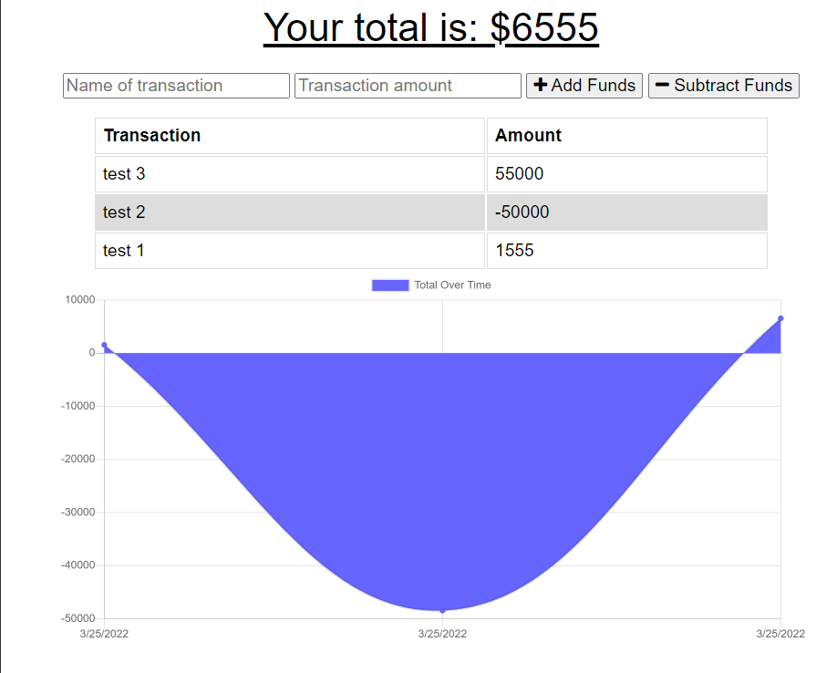

# Budget Tracker

Budget tracker is an application that allows you to track incoming and outgoing transactions.

This project required the application be modified to work offline and be able to update again once online.
## Authors
- [@charlestietjen](https://www.github.com/charlestietjen)
## License

[MIT](https://choosealicense.com/licenses/mit/)

## Deployed App

[Deployed Application](https://trilogy-hw-budget-tracker.herokuapp.com/)
## Screenshots


## Installation

To install the application locally, run:

```bash
'npm i'
``` 
This will install all dependencies required to run the application.

Required modules can be reviewed in the package.json.
## Run Locally

Lastly run the server with:

```bash
npm start
```

Navigate to either http://localhost:3001/ if running locally, or the domain and port the application is listening on. 